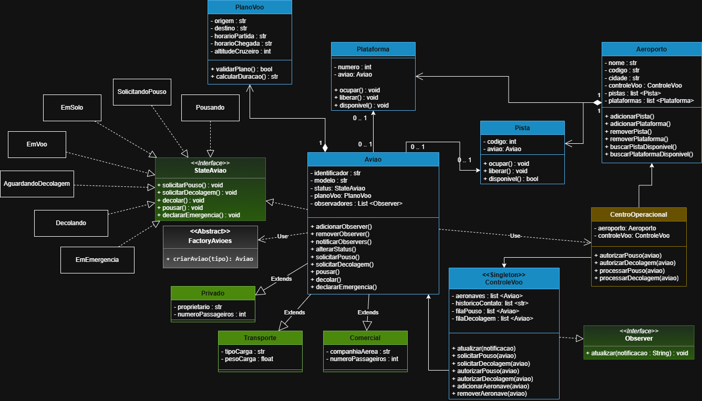

# Sistema de Gerenciamento de Tráfego Aeroportuário

## Descrição do Tema e Objetivo

Este projeto consiste em um Sistema de Gerenciamento de Tráfego Aeroportuário desenvolvido em Python com foco na aplicação de Programação Orientada a Objetos (POO) e padrões de projeto.

O sistema modela o ambiente operacional de um aeroporto, permitindo o gerenciamento de aeronaves, planos de voo, pousos, decolagens, emergências, pistas e plataformas. O objetivo principal não é a simulação gráfica, mas sim a construção de uma arquitetura orientada a objetos sólida, extensível e aderente às boas práticas de engenharia de software.

---

# Diagrama de Classes

> Inserir a imagem UML presente no repositório.

```md

```

---

# Funcionalidades Implementadas

- Cadastro e gerenciamento de aeronaves.
- Criação de aeronaves por meio de Factory Method.
- Controle de estados operacionais das aeronaves.
- Solicitação e autorização de pousos.
- Solicitação e autorização de decolagens.
- Tratamento de situações de emergência.
- Controle de filas de pouso e decolagem.
- Monitoramento de eventos através do padrão Observer.
- Gerenciamento de pistas e plataformas.
- Validação de planos de voo.
- Centralização do controle de tráfego através de Singleton.

---

# Arquitetura Geral

Fluxo operacional principal:

```text
Aeronave
    ↓
ControleVoo
    ↓
CentroOperacional
    ↓
Aeroporto
    ↓
Pistas e Plataformas
```

## Responsabilidades

### ControleVoo
Responsável pelo gerenciamento do tráfego aéreo:

- Controle das filas de pouso.
- Controle das filas de decolagem.
- Monitoramento das aeronaves.
- Priorização automática de emergências.

### CentroOperacional
Camada intermediária responsável por reduzir o acoplamento entre ControleVoo e Aeroporto.

Funções:

- Autorizar pousos.
- Autorizar decolagens.
- Alocar pistas.
- Alocar plataformas.
- Processar operações aeroportuárias.

### Aeroporto
Responsável exclusivamente pela infraestrutura física:

- Armazenar pistas.
- Armazenar plataformas.
- Disponibilizar recursos livres.

---

# Descrição das Classes

## Aviao (Classe Abstrata)

Classe base de todas as aeronaves.

### Atributos

- identificador
- modelo
- status
- planoVoo
- observadores

### Responsabilidades

- Gerenciar estado operacional.
- Gerenciar plano de voo.
- Notificar observadores.
- Delegar comportamento ao padrão State.

---

## Comercial

Especialização de Aviao para transporte de passageiros.

### Atributos

- companhiaAerea
- numeroPassageiros

---

## Privado

Especialização de Aviao para uso particular.

### Atributos

- proprietario
- numeroPassageiros

---

## Transporte

Especialização de Aviao para transporte de cargas.

### Atributos

- tipoCarga
- pesoCarga

---

## PlanoVoo

Representa as informações operacionais do voo.

### Atributos

- origem
- destino
- horarioPartida
- horarioChegada
- altitudeCruzeiro

### Responsabilidades

- Armazenar dados do voo.
- Validar consistência do plano.

---

## ControleVoo

Implementa os padrões Observer e Singleton.

### Responsabilidades

- Gerenciar aeronaves.
- Organizar filas.
- Priorizar emergências.
- Receber notificações de mudança de estado.

---

## CentroOperacional

Responsável pela coordenação entre controle de tráfego e infraestrutura aeroportuária.

### Responsabilidades

- Autorizar operações.
- Gerenciar alocação de recursos.
- Intermediar comunicação entre os componentes.

---

## Aeroporto

Representa a infraestrutura aeroportuária.

### Responsabilidades

- Gerenciar pistas.
- Gerenciar plataformas.
- Disponibilizar recursos livres.

---

## Pista

Representa uma pista operacional.

### Responsabilidades

- Ocupar.
- Liberar.
- Verificar disponibilidade.

---

## Plataforma

Representa uma posição de estacionamento.

### Responsabilidades

- Ocupar.
- Liberar.
- Verificar disponibilidade.

---

# Pilares da Programação Orientada a Objetos

## Encapsulamento

Os atributos são protegidos utilizando o padrão:

```python
_atributo
```

O acesso é realizado através de properties e métodos específicos.

Benefícios:

- Proteção dos dados.
- Controle de acesso.
- Validações centralizadas.

---

## Herança

As classes:

- Comercial
- Privado
- Transporte

herdam da classe Aviao.

Benefícios:

- Reutilização de código.
- Redução de duplicação.
- Facilidade de manutenção.

---

## Polimorfismo

Todas as aeronaves podem ser manipuladas através da abstração Aviao.

Exemplo:

```python
lista_aeronaves = [Comercial(), Privado(), Transporte()]
```

---

## Abstração

O sistema modela apenas características relevantes do domínio aeroportuário, ocultando detalhes desnecessários da implementação.

---

# Padrões de Projeto Utilizados

## Factory Method

Classe responsável:

```text
FactoryAvioes
```

Objetivo:

Centralizar a criação de aeronaves.

Tipos suportados:

- Comercial
- Privado
- Transporte

Vantagens:

- Desacoplamento.
- Facilidade de expansão.
- Padronização da criação.

---

## State Pattern

Controla o comportamento operacional das aeronaves.

Estados implementados:

- EmSolo
- AguardandoDecolagem
- Decolando
- EmVoo
- SolicitandoPouso
- Pousando
- EmEmergencia

Cada estado implementa:

- solicitarPouso()
- solicitarDecolagem()
- decolar()
- pousar()
- declararEmergencia()

Benefícios:

- Eliminação de condicionais complexas.
- Alta coesão.
- Fácil manutenção.

---

## Observer Pattern

### Observado

Aviao

### Observador

ControleVoo

Sempre que ocorre uma mudança de estado, os observadores são notificados automaticamente.

Benefícios:

- Baixo acoplamento.
- Comunicação automática.
- Fácil expansão.

---

## Singleton Pattern

Aplicado na classe ControleVoo.

Objetivo:

Garantir a existência de apenas uma central de controle durante toda a execução do sistema.

Benefícios:

- Consistência dos dados.
- Controle centralizado.
- Evita instâncias conflitantes.

---

# Fluxos Principais

## Fluxo de Decolagem

```text
EmSolo
   ↓
AguardandoDecolagem
   ↓
Decolando
   ↓
EmVoo
```

## Fluxo de Pouso

```text
EmVoo
   ↓
SolicitandoPouso
   ↓
Pousando
   ↓
EmSolo
```

## Fluxo de Emergência

```text
Qualquer Estado
        ↓
  EmEmergencia
        ↓
 Prioridade Máxima
        ↓
 Pouso Emergencial
```

---

# Instruções de Execução

## Clonar o repositório

```bash
git clone <url-do-repositorio>
cd SistemaGerenciamentoAeroporto
```

## Executar o sistema

```bash
python main.py
```

---

# Testes

Os testes encontram-se na pasta:

```text
Tests/
```

Para executar:

```bash
python -m pytest
```

Ou individualmente:

```bash
python Tests/test_aviao.py
python Tests/test_controleVoo.py
python Tests/test_pista.py
python Tests/test_plataforma.py
python Tests/test_planoVoo.py
```

---

# Detalhamento de Aprendizado

## Dificuldades Encontradas

### Implementação do padrão State

A principal dificuldade foi modelar corretamente as transições entre estados sem utilizar estruturas condicionais extensas.

### Import Circular

Alguns estados dependiam diretamente de outros estados, gerando dependências circulares.

Exemplo:

```text
EmEmergencia → Pousando
Pousando → EmEmergencia
```

## Como Resolvi

Foram utilizados imports locais dentro dos métodos responsáveis pelas transições.

Exemplo:

```python
def declararEmergencia(self):
    from Models.States.EmEmergencia import EmEmergencia
```

Essa abordagem eliminou os ciclos de importação e manteve a arquitetura desacoplada.

## Principal Aprendizado

O desenvolvimento permitiu aprofundar conhecimentos em:

- Programação Orientada a Objetos.
- Modelagem de domínio.
- State Pattern.
- Observer Pattern.
- Singleton.
- Factory Method.
- Coesão e acoplamento.
- Organização arquitetural de sistemas.

---

# Declaração de Uso de IA

Utilizei IA como ferramenta de apoio.

### Ferramenta(s)

- ChatGPT e BlackBox

### Finalidade

- Apoio na documentação.
- Revisão arquitetural.
- Esclarecimento de conceitos de POO.
- Validação de decisões de modelagem.
- Organização e refinamento textual.

### Validação

Declaro que todo o código gerado foi lido, testado e ajustado conforme as necessidades específicas do projeto e da disciplina. A responsabilidade pela arquitetura, decisões de design e correção do código é de minha total responsabilidade.

---

# Autor

Rafael Albuquerque de Paula
